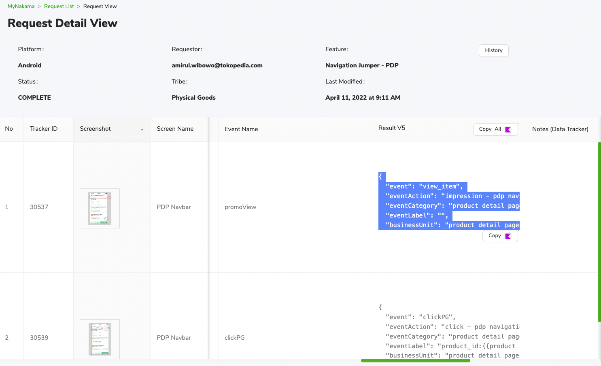
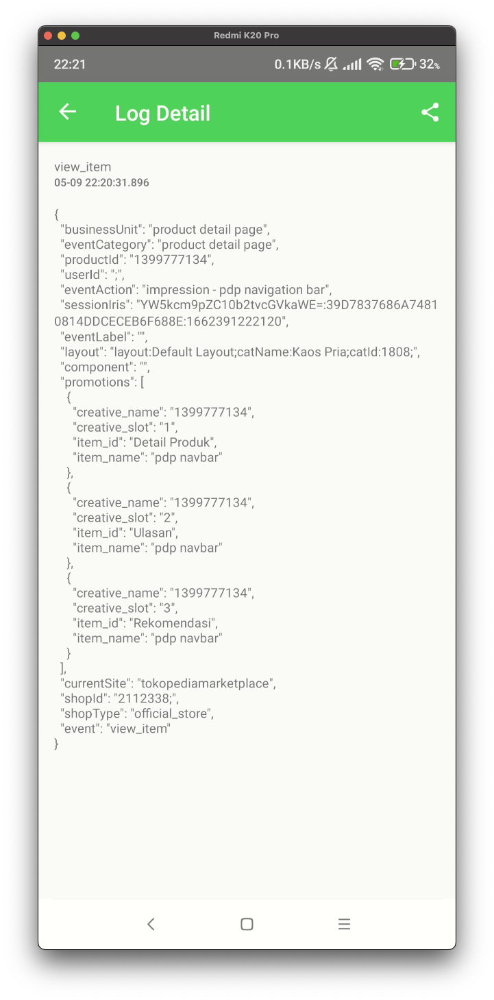

---
Tracking Queue
---


| **Status** | <!--start status:GREEN-->RELEASE<!--end status--> |
| --- | --- |
| Contributors | [Kelvindo Sutan](https://tokopedia.atlassian.net/wiki/people/5ff2a8fe44065f013f93507c?ref=confluence)  |
| Product Manager | [Yehezkiel .](https://tokopedia.atlassian.net/wiki/people/5c94aa7a7792242c8613ad14?ref=confluence)  |
| Team | [Minion Stuart](https://tokopedia.atlassian.net/people/team/eeba862a-bd9d-472c-b901-415b15b1a37e) |
| Release date | - |
| Module type | <!--start status:PURPLE-->INTERNAL-LIBRARY<!--end status--> |
| Module Location | `libraries.tracking_optimizer` | `libraries.track` |

## Table of Contents

<!--toc-->

## Release Notes

<!--start expand:14 Dec 22-->
Initial Release
<!--end expand-->

## Overview

Previously we learn how to create General Event type of tracker. In this part, we will learn another type of tracker. We call it Tracking Queue.

Instead of send the event immediately, we can queue the data, then send later

.

### Background

1. You want to reduce number of hit to GTM
2. You want to group the data before hit to GTM

## How-to


```
implementation projectOrAar(rootProject.ext.libraries.trackOptimizer)
```

### Requirement

Check the *Thanos* in <https://mynakama.tokopedia.com/datatracker/requestdetail/view/2980>. For this example take a look at No. 1 tracker (first row). Find the *Event Name* and Result V5.




By assuming you already read the General Event. This documentation will be less specific.  
If you didn’t please check [this](General%20Event.md).


```
{
  "event": "view_item",
  "eventAction": "impression - pdp navigation bar",
  "eventCategory": "product detail page",
  "eventLabel": "",
  "businessUnit": "product detail page",
  "component": "'comp:{{component name}};temp:{{template name}};elem:{{element name}};cpos:{{component position}};', //component level attribute",
  "currentSite": "tokopediamarketplace",
  "layout": "'layout:{{layout name}};catName:{{category name}};catId:{{category id}};', //layout level attribute",
  "productId": "'{{Product ID}}', //Product ID of product displayed on PDP",
  "promotions": [
    {
      "creative_name": "{{product id}}",
      "creative_slot": "{{button position}} //start from 1, back-to-top button = 0",
      "item_id": "{{button name}}",
      "item_name": "pdp navbar"
    },
    {
      "creative_name": "{{product id}}",
      "creative_slot": "{{button position}} //start from 1, back-to-top button = 0",
      "item_id": "{{button name}}",
      "item_name": "pdp navbar"
    }
  ],
  "shopId": "{{shop_id}};', //shop_id level hit",
  "shopType": "'{{shop_type}}', //official_store, gold_merchant, regular",
  "userId": "{{user_id}};', //user_id level hit, pass null if non login"
}
```

There are some information that we can tell from the JSON:

- This is tracker is *Impression event.*
- The “promotions” value are array of item. so when there are 3 impression, it should be group into 1 event, with multiple “promotions”.

### Next Step

Similar with General Event, we will convert JSON into `hashMapOf`. But there will be adjustment

.

 

Instead of “view\_item” we should replace the “event” with Event Name from MyNakama. So it become “promoView”.


```
val mapEvent = hashMapOf<String, Any>(
    "event" to "promoView",
    "eventAction" to "impression - pdp navigation bar",
    "eventCategory" to "product detail page",
    "eventLabel" to "",
    "businessUnit" to "product detail page",
    "component" to "comp:$componentName;temp:$templateName;elem:$elementName;cpos:$position;",
    "currentSite" to "tokopediamarketplace",
    "layout" to "layout:$layoutName;catName:$categoryName;catId:$categoryId;",
    "productId" to productId,
    "promotions" to arrayListOf(
      hashMapOf(
          "creative_name" to productId,
          "creative_slot" to buttonPosition,
          "item_id" to buttonName,
          "item_name" to "pdp navbar"
      )
    ),
    "shopId" to "$shopId;",
    "shopType" to shopType,
    "userId" to "$userId;"
)
```

- As mentioned before, the array promotions will be group, that’s why we only write it once in our `hashMapOf`
- To make the library know which part should be group, we need to adjust it, follow the `trackOptimizer` rules.

The formula:


```
"ecommerce" to hashMapOf(
    "promoView" to hashMapOf( // the key is Event Name
        "promotions" to arrayListOf(
            hashMapOf(
                "creative_name" to productId,
                "creative_slot" to buttonPosition,
                "item_id" to buttonName,
                "item_name" to "pdp navbar"
            )
        )
    )
)
```

Then the hashMapOf become:


```
val mapEvent = hashMapOf<String, Any>(
    "event" to "promoView",
    "eventAction" to "impression - pdp navigation bar",
    "eventCategory" to "product detail page",
    "eventLabel" to "",
    "businessUnit" to "product detail page",
    "component" to "comp:$componentName;temp:$templateName;elem:$elementName;cpos:$position;",
    "currentSite" to "tokopediamarketplace",
    "layout" to "layout:$layoutName;catName:$categoryName;catId:$categoryId;",
    "productId" to productId,
    "ecommerce" to hashMapOf(
        "promoView" to hashMapOf(
            "promotions" to arrayListOf(
                hashMapOf(
                    "creative_name" to productId,
                    "creative_slot" to buttonPosition,
                    "item_id" to buttonName,
                    "item_name" to "pdp navbar"
                )
            )
        )
    ),
    "shopId" to "$shopId;",
    "shopType" to shopType,
    "userId" to "$userId;"
)
```

 

(4/Nov/2022) Only the event with name `productView`, `promoView`, and `viewProduct` will be group into 1 tracker with multiple promotions. The other event name will be treat as individual tracker (with only 1 item in promotions array).

After that, use trackingQueue to handle the event


```
trackingQueue.putEETracking(mapEvent)
```

if the 

`mapEvent` correct, it will be store into local database, then will be push later when 

`trackingQueue.sendAll()`.


### Result

For this example, we will wrap mapEvent and trackingQueue into single function


```
fun sendImpressionPdpNavigationBarEvent(
  trackingQueue: TrackingQueue
  componentName: String,
  templateName: String,
  elementName: String,
  position: Int,
  layoutName: String,
  categoryName: String,
  categoryId: String,
  productId: String,
  buttonPosition: Int,
  buttonName: String,
  shopId: String,
  shopType: String,
  userId: String
){
  val mapEvent = hashMapOf<String, Any>(
      "event" to "promoView",
      "eventAction" to "impression - pdp navigation bar",
      "eventCategory" to "product detail page",
      "eventLabel" to "",
      "businessUnit" to "product detail page",
      "component" to "comp:$componentName;temp:$templateName;elem:$elementName;cpos:$position;",
      "currentSite" to "tokopediamarketplace",
      "layout" to "layout:$layoutName;catName:$categoryName;catId:$categoryId;",
      "productId" to productId,
      "ecommerce" to hashMapOf(
          "promoView" to hashMapOf(
              "promotions" to arrayListOf(
                  hashMapOf(
                      "creative_name" to productId,
                      "creative_slot" to buttonPosition,
                      "item_id" to buttonName,
                      "item_name" to "pdp navbar"
                  )
              )
          )
      ),
      "shopId" to "$shopId;",
      "shopType" to shopType,
      "userId" to "$userId;"
  )
  trackingQueue.putEETracking(mapEvent)
}
```

- Call those line of code at expected action. In this example, invoke the function when Navigation Tab impressed.
- Debug from Developer Options





The TrackingQueue hit 3 times and group into 1 tracker with multiple “promotions” item.


